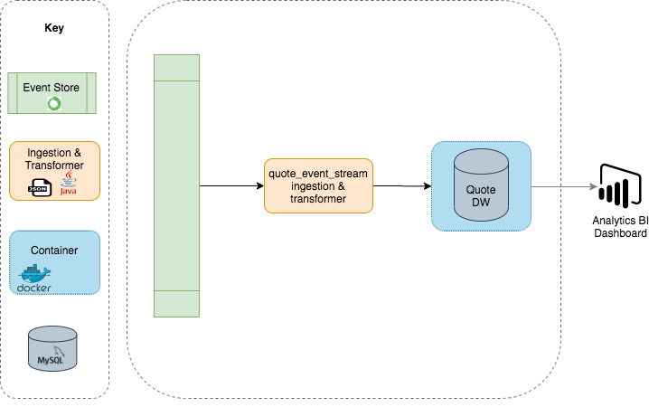

# quote-event-stream

This service streams quote events using [eventstore](https://eventstore.com/) to SQL DB for the data analysts to produce reports. This captures user behaviour as they are completing quote steps to help determine the number of products “active” in a quote at any one time.

### Architecture

This POC shows the current architecture

This is a proposed target architecture

### ERD

Quote started events are added to the quotes table and subsequent quote products updates will update and insert (upsert) the quote_items table 

## Getting started

These instructions will get you a copy of the project up and running on your local machine for development and testing purposes.

## Prerequisites

A detailed, step by step guide, of the setup of any external dependencies that a service/project may have, including node, dotnet core, and docker.

### Event store
[Event Store](https://eventstore.com/docs/getting-started/index.html)

You have two options of running the Event Store, either a pre-configured connection or local setup:
The pre-configured is already setup, you may skip this step. 

#### Pre-configured 
EventStore Connection Details
- [Web URL: http://167.99.81.240:2113/](http://167.99.81.240:2113/)
- [TCP URL: tcp://167.99.81.240:1113/](tcp://167.99.81.240:1113/)

#### Local setup
Install and run event store locally `bash local_setup/event_sink_setup.sh`

EventStore connection details
- [Web URL: 127.0.0.1:2113](http://127.0.0.1:2113/)
- [TCP URL: tcp://127.0.0.1:1113](tcp://127.0.0.1:1113/)
- Username: `admin`
- Pass: `changeit`

### MySQL

I'd recommend installing [JetBrains DataGrip](https://www.jetbrains.com/datagrip/features/mysql.html) IDE for working with SQL and databases
- Default port 3306 used for the connection
- Once installed, create the schema [scripts](./scripts/000_create_schema.sql)

## Installing

Step by step instructions on how to get a working version of the project on your local machine, such as

- Clone repository
- Run `mvn clean install` 
- Run `bash local_setup/service_startup.sh` to start mysql in docker (script also sets env vars)
- Run `RunEventStore` for reading events 

* NOTE: The following needs to be addressed: 
- Akka actors and Spring needs to be connected to see the contents of the events in SQL. 
- This application only takes a single event and should ideally stream all events.

# Running the tests

Run 
> `mvn test -Ddependency-check.skip=true` 

# Clean up

remove any unused containers 
> `docker system prune -a`

remove any unused volumes 
> `docker volume prune`

# Source

 * [EventStore Docs](https://eventstore.com/docs/)
 * [Java 8](https://www.java.com/pt_BR/download/faq/java8.xml)
 * [Spring Boot](https://spring.io/projects/spring-boot)
 * [DataGrip](https://www.jetbrains.com/datagrip/features/mysql.html)
 * [mysql Docker](https://hub.docker.com/_/mysql)
 * [sql instance with Docker](https://medium.com/@chrischuck35/how-to-create-a-mysql-instance-with-docker-compose-1598f3cc1bee)
 * [json_schema_2_pojo](http://www.jsonschema2pojo.org/)
 
 
 ### Questions
 What concerns would you have on your SQL with a much larger data set? Analysts could run multiple queries that will cause slow down. 
 - Some ideas: Identify bottlenecks running SQL Profiler to analyse query usage and execution numbers. Running DB optimisation by looking at how analysts use DB for searching / querying. Consider fields & tables for indexing Consider running overnight batch jobs using DP / Airflow Consider scaling vertically
 
 Did you encounter any invalid data? 
 - Some inconsistencies in the naming of the data properties, some null values where I'd expect to see data. I suspect there are more around the data types & data format.
 
 What language did you select to implement this challenge? Why? 
 - It was between Scala and Java. As I am new to the Java world and wanted to learn the language whilst doing this challenge. Java lends itself to OOP and from Java 8 it lends itself more to functional programming. There are very well known streaming tools, such as kafka which are built on the JDK. Giving the benefit of making use of kstreams and kSQL. Java provides Hibernate which is great for ORM mapping and creates a good standard for team members to follow. Saying all this, it took me some time to get my head around setting up Hibernate and SpringBoot. Making use of Akka for the streaming. It is challenging getting akka actors to integrate with spring.
 
 What would you do differently to your implementation if you had more time? 
 - The target operating model in the architecture diagram would separate the streaming and add a buffer for other applications to do data transformation. I would look at de-coupling the ETL. Example, I would look at introducing a Kafka broker, as the transformation of data can grow and create a bottleneck. A intermediate kafka broker would also act as a buffer, as one micro-service would need to scale and should have a single responsibility. Introduce a DLQ for serialisation issues etc. Add health check for services. I'd include metadata and event version numbers etc.
 
 What technologies would you use run this service? 
 - Java, Parquet, Docker, K8s, Snowflake
 
 What testing did (or would) you do, and why? 
 - The json deserialization is tested. 
 - More tests should include testing the event types and commit the offset manually. 
 - Some application errors expected: 
    - consumer errors: invalid JSON, 
    - Deserialize event (Done)
    - mapping events to objects (filtering)
    - transformation errors: valid JSON but exception thrown in processing
    - producer errors: cannot write to sql 
    - app cannot connect to ES or sql when starting (heart beat)
    - app loses connection to ES while running
    - what gets committed when
    - message size (too big?)
    - PK / FK constraints 
 - (reducing) multiple transactions 
 - Any DQ & transformation checks should ideally live outside the streaming app and can be tested there
 